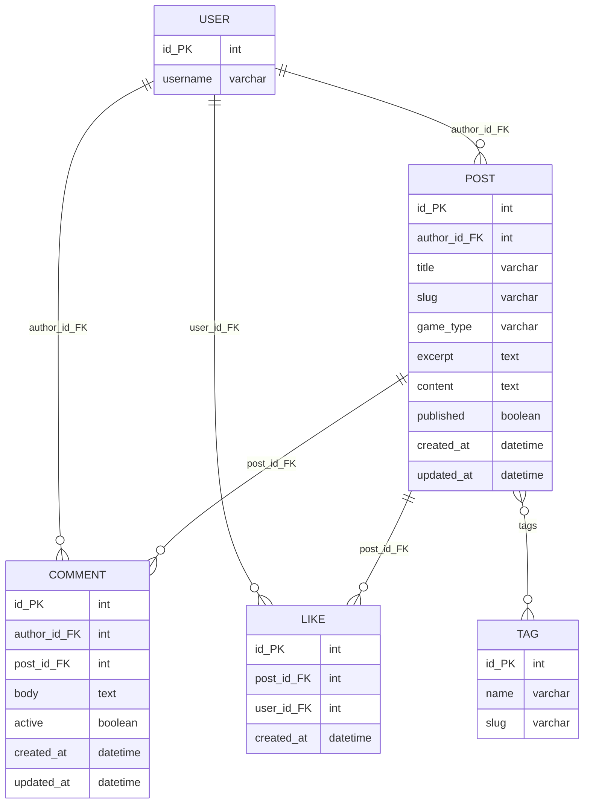

## Table of Contents
- [Features](#features)
- [User Stories](#user-stories)
- [Design & Accessibility](#design--accessibility)
- [Technologies Used](#technologies-used)
- [Testing](#testing)
- [JavaScript Testing](#javascript-testing)
- [Deployment](#deployment)
- [Local Setup](#local-setup)
- [AI Use](#ai-use)

---

# The Game Ledger — Game Blog

**Live site:** _TBD_
**Repository:** https://github.com/JoshuaCottle/game_blog

---

## Project Overview

The Game Ledger is a Django-powered blog platform for video, board, and tabletop games. Users can register, create posts with images, comment, and like posts. The home page supports filtering by game type and searching by title.

**Author:** Joshua Cottle  
**Responsibilities:** Project structure, Django models/views/forms, templates, styling, documentation

---

## Database Structure (ERD)


Interactive ERD: [View on dbdocs.io](https://dbdocs.io/jcottle33/Game-Blog-DIagram?view=relationships)



---

## Features
- Post list with filter buttons (video, board, tabletop, tags)
- Search by post title
- Image uploads for posts
- CRUD for posts (author-only edit/delete)
- Comments and likes on post detail pages
- Authentication (register, login, logout)
- Responsive, accessible design

---

## User Stories

**Must Have**
- See recent posts with images
- Register, log in, create posts, comment
- Edit own posts, comment and like posts
- Only authors can edit their posts

**Should Have**
- Delete own posts/comments
- Filter posts by game type
- Search posts by title

**Could Have**
- See login state, easy logout
- Admin moderation for posts/comments

---
## Design & Accessibility
- Clean, card-based layout
- Accessible form controls, clear spacing
- Responsive for desktop and mobile
- Semantic HTML, ARIA labels, skip-to-content link
- Lighthouse audit for WCAG compliance

---

## Technologies Used
- Python 3, Django 4.2
- SQLite (local) / PostgreSQL (production)
- HTML, CSS
- Cloudinary (planned for production media)

---

## Testing

### Manual Testing
| Feature         | Test Case                | Expected Result         |
|-----------------|-------------------------|------------------------|
| Post list       | Visit /blog/            | See published posts    |
| Post filter     | Click filter buttons    | Only matching posts    |
| Post search     | Enter search query      | Filtered results       |
| Post create     | Submit new post form    | Post appears in list   |
| Post edit       | Edit own post           | Changes saved          |
| Post delete     | Delete own post         | Post removed           |
| Comment add     | Submit comment form     | Comment appears        |
| Like toggle     | Click like button       | Like/unlike reflected  |
| Auth/register   | Register/login/logout   | Auth state changes     |

### Unit Tests
Run with:
```bash
./.venv/Scripts/python.exe manage.py test blog
```
Covers: Post model, Comment model, Post list view, filtering, relationships.

---

## JavaScript Testing

Client-side JS validation and instant notification logic are tested using Jest.

**To run JS tests:**
1. Install Node.js and npm.
2. Install Jest:
   ```bash
   npm install --save-dev jest
   ```
3. Test file: `static/js/formValidation.test.js` (provided).
4. Add to `package.json`:
   ```json
   "scripts": { "test": "jest" }
   ```
5. Run:
   ```bash
   npx jest static/js/formValidation.test.js
   ```

---

## Deployment
- Heroku (planned)
- **Environment variables required:**
  - `SECRET_KEY`
  - `DATABASE_URL`
  - `CLOUDINARY_URL` (if using Cloudinary)
  - `DEBUG` (set to `False` in production)

---

## Local Setup
1. Create and activate a virtual environment.
2. Install dependencies:
   ```bash
   ./.venv/Scripts/python.exe -m pip install -r requirements.txt
   ```
3. Create `env.py` and set `SECRET_KEY` (and `DATABASE_URL` if using Postgres).
4. Apply migrations:
   ```bash
   ./.venv/Scripts/python.exe manage.py migrate
   ```
5. Run the dev server:
   ```bash
   ./.venv/Scripts/python.exe manage.py runserver
   ```
6. Visit [http://127.0.0.1:8000/](http://127.0.0.1:8000/)

---

## AI Use
- GitHub Copilot and AI tools used for debugging, refactoring, and documentation.
- Reflections on AI use included in README.

---

## Credits
- Project Author: Joshua Cottle
- Icons/Images: Author-provided or user-uploaded content
