## License
This project is licensed under the MIT License. See the LICENSE file for details.

## Contact

# The Game Ledger — Game Blog

**Live site:** _TBD_  
**Repository:** https://github.com/JoshuaCottle/game_blog

---

## Summary

The Game Ledger is a Django-powered blog platform for video, board, and tabletop games. It provides a user-friendly, accessible, and responsive interface for sharing and discovering game reviews and stories. Users can register, log in, create, edit, and delete posts, comment, and like posts. The site features robust access control, notifications, and is fully validated for HTML, CSS, accessibility, and performance. All development is tracked via a public GitHub Project Board, with thorough documentation and testing included.

---

## Table of Contents
- [Project Overview](#project-overview)
- [Features](#features)
- [User Stories](#user-stories)
- [Design & Accessibility](#design--accessibility)
- [Wireframes](#wireframes)
- [Database Structure (ERD)](#database-structure-erd)
- [Technologies Used](#technologies-used)
- [Testing](#testing)
- [JavaScript Testing](#javascript-testing)
- [Deployment](#deployment)
- [Local Setup](#local-setup)
- [AI Use](#ai-use)
- [Credits](#credits)
- [License](#license)
- [Contact](#contact)

---

## Project Overview

The Game Ledger is a Django-powered blog platform for video, board, and tabletop games. Users can register, create posts with images, comment, and like posts. The home page supports filtering by game type and searching by title.

**Author:** Joshua Cottle  
**Responsibilities:** Project structure, Django models/views/forms, templates, styling, documentation

---

## Features
- Post list with filter buttons (video, board, tabletop, tags) 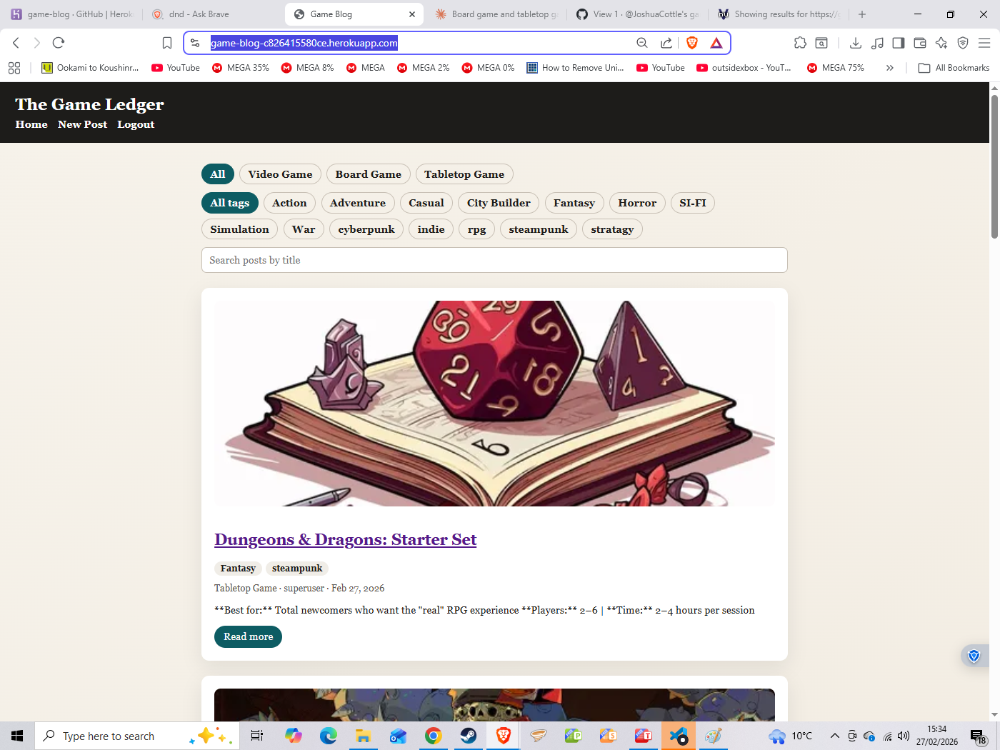
- Search by post title 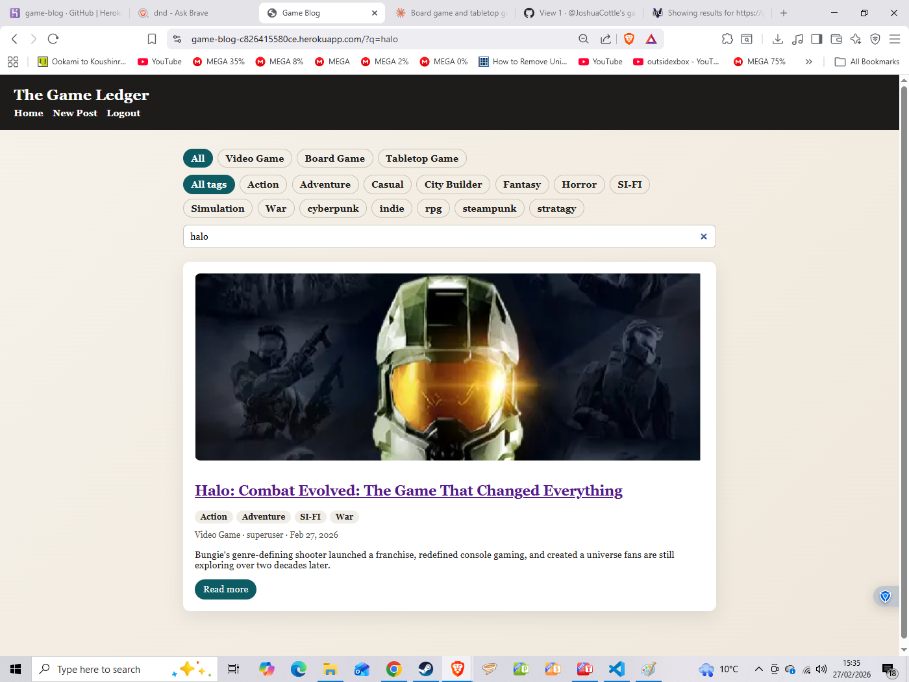
- Image uploads for posts 
- CRUD for posts (author-only edit/delete) 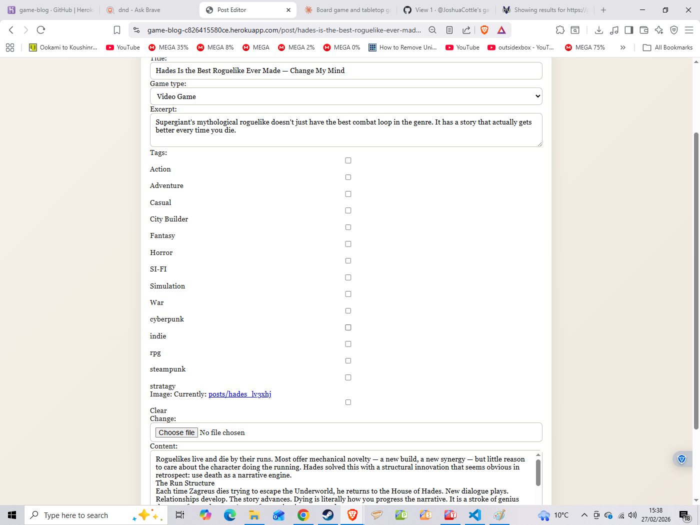
- Comments and likes on post detail pages 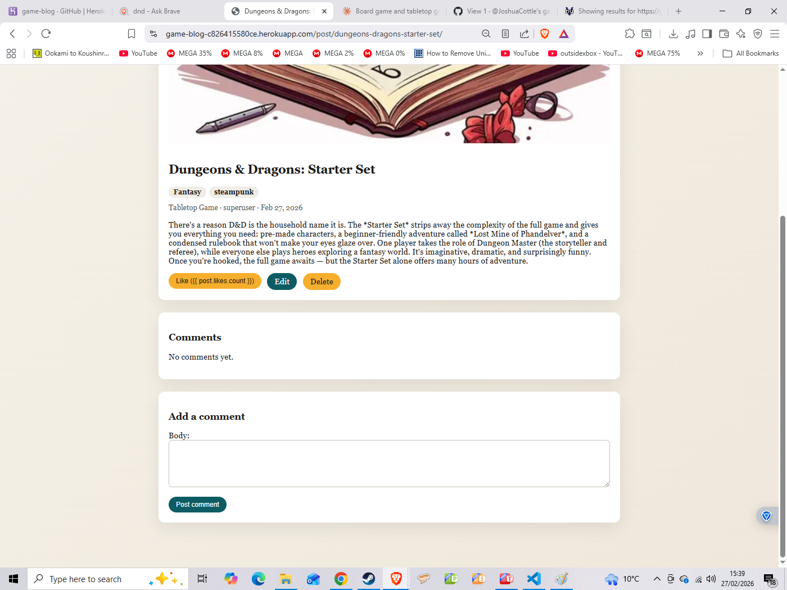
- Authentication (register, login, logout) 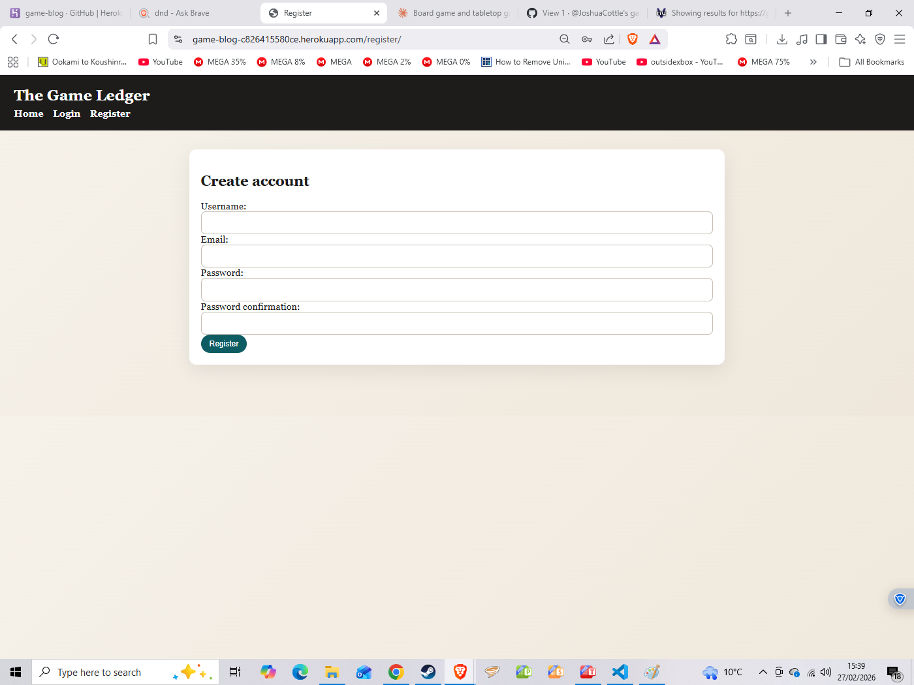
- Responsive, accessible design 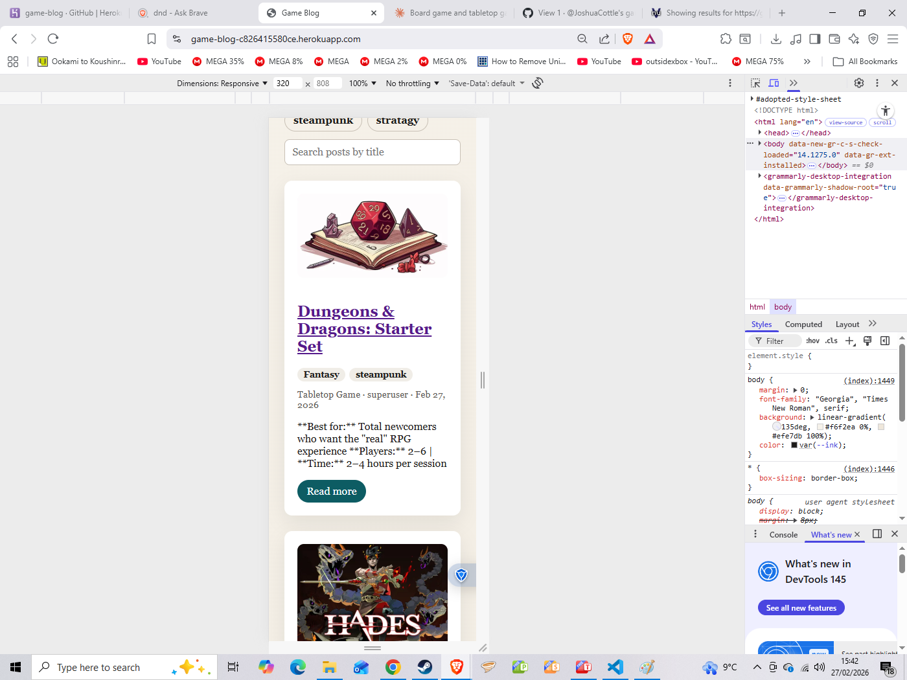
  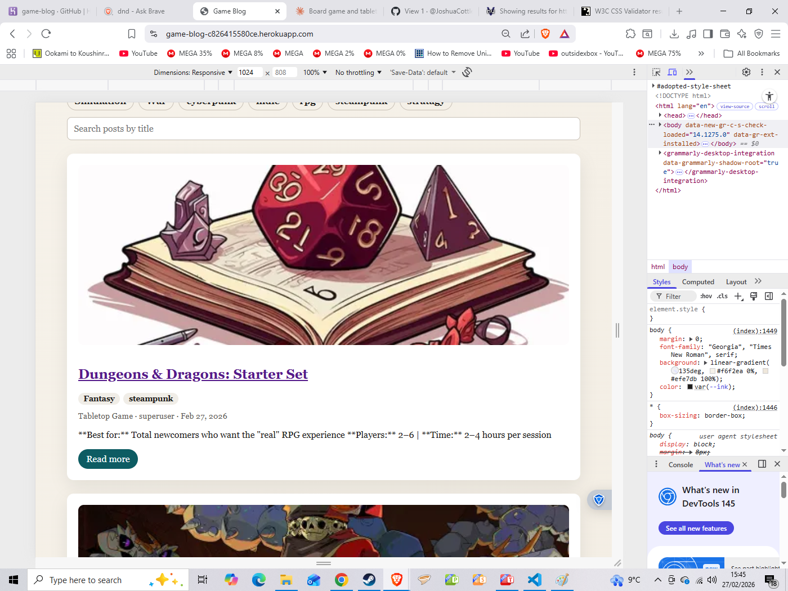
  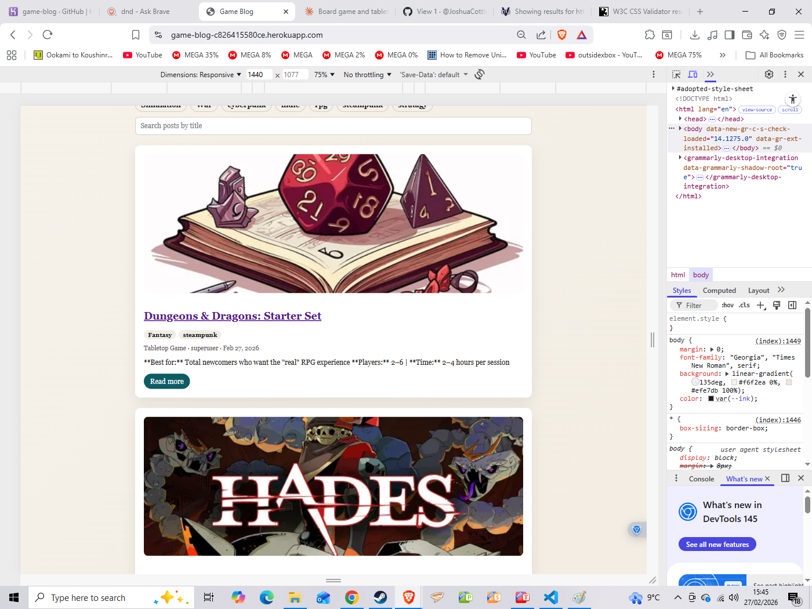
---

## User Stories

**Must Have**
- See recent posts with images
- Register, log in, create posts, comment
- Edit own posts, comment and like posts
- Only authors can edit their posts

**Should Have**
- Delete own posts/comments
- Filter posts by game type
- Search posts by title

**Could Have**
- See login state, easy logout
- Admin moderation for posts/comments

---

## Design & Accessibility
- Clean, card-based layout
- Accessible form controls, clear spacing
- Responsive for desktop and mobile
- Semantic HTML, ARIA labels, skip-to-content link
- Lighthouse audit for WCAG compliance

---

## Wireframes

### Home / Post List (Desktop)
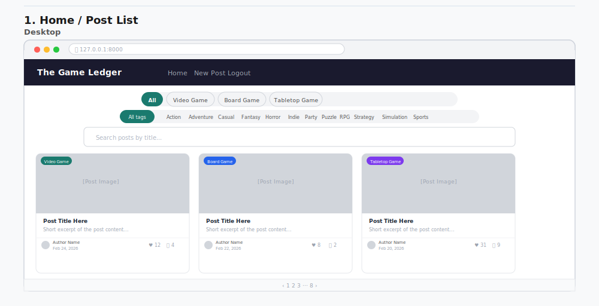
```
------------------------------------------------------
| Logo         Home  Login/Register  Profile           |
------------------------------------------------------
| Filter: Video  Board  Tabletop  Tags                 |
------------------------------------------------------
| Search Bar                                       [ ] |
------------------------------------------------------
| [Post Card]   [Post Card]   [Post Card]   ...        |
|  - Image      - Title        - Excerpt               |
|  - Author     - Date         - Like/Comment Count    |
------------------------------------------------------
| Pagination                                          |
------------------------------------------------------
```

### Home / Post List (Mobile)
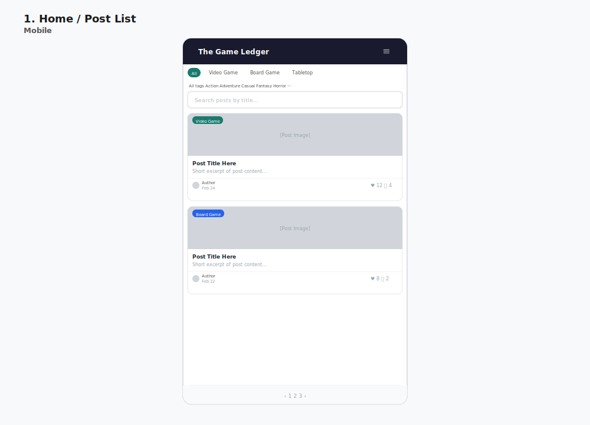
```
-------------------------------+
| Logo        ☰                 |
-------------------------------+
| Filter: Video  Board  Tabletop|
| Tags                          |
-------------------------------+
| Search Bar                    |
-------------------------------+
| [Post Card]                   |
|  - Image                      |
|  - Title                      |
|  - Excerpt                    |
|  - Author  Date  Like/Comment |
-------------------------------+
| Pagination                    |
-------------------------------+
```

### Post Detail (Desktop)
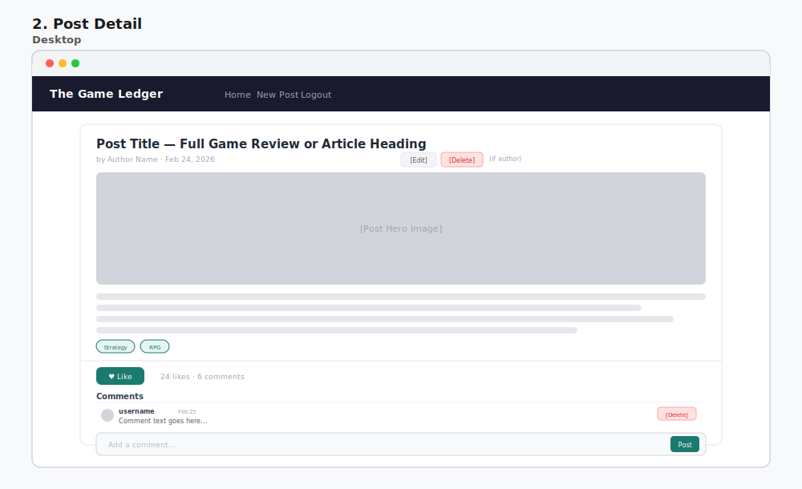
```
------------------------------------------------------
| Logo         Home  Login/Register  Profile           |
------------------------------------------------------
| Post Title                                         |
| by Author on Date   [Edit] [Delete] (if author)     |
------------------------------------------------------
| [Image]                                            |
| [Content]                                          |
| [Tags]                                             |
------------------------------------------------------
| Like Button  Like Count  Comment Count              |
------------------------------------------------------
| Comments:                                          |
|  - User  Date  Comment Text  [Delete] (if owner)    |
|  ...                                               |
------------------------------------------------------
| Add Comment Form                                   |
------------------------------------------------------
```

### Post Create/Edit (Desktop)
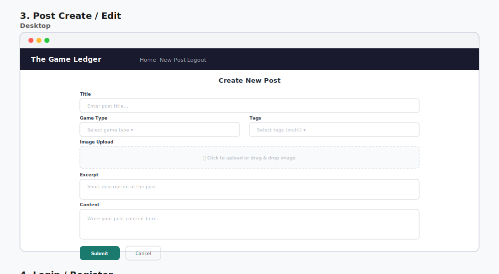
```
------------------------------------------------------
| Logo         Home  Logout  Profile                   |
------------------------------------------------------+
| Form: Title                                         |
| Form: Game Type Dropdown                            |
| Form: Tags Multi-select                             |
| Form: Image Upload                                  |
| Form: Excerpt                                       |
| Form: Content                                       |
| [Submit] [Cancel]                                   |
------------------------------------------------------+
```

### Login/Register (Desktop)
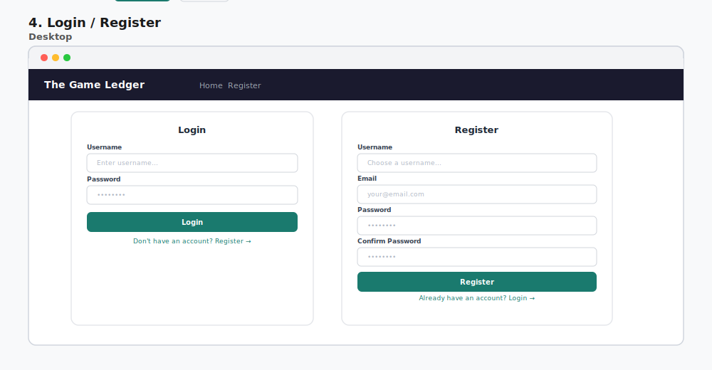
```
------------------------------------------------------+
| Logo         Home  Register                          |
------------------------------------------------------+
| Login Form:                                         |
|  - Username                                         |
|  - Password                                         |
|  [Login]                                            |
|  [Register Link]                                    |
------------------------------------------------------+
| Register Form:                                      |
|  - Username                                         |
|  - Email                                            |
|  - Password                                         |
|  - Confirm Password                                 |
|  [Register]                                         |
------------------------------------------------------+
```

### Mobile Views (All Pages)
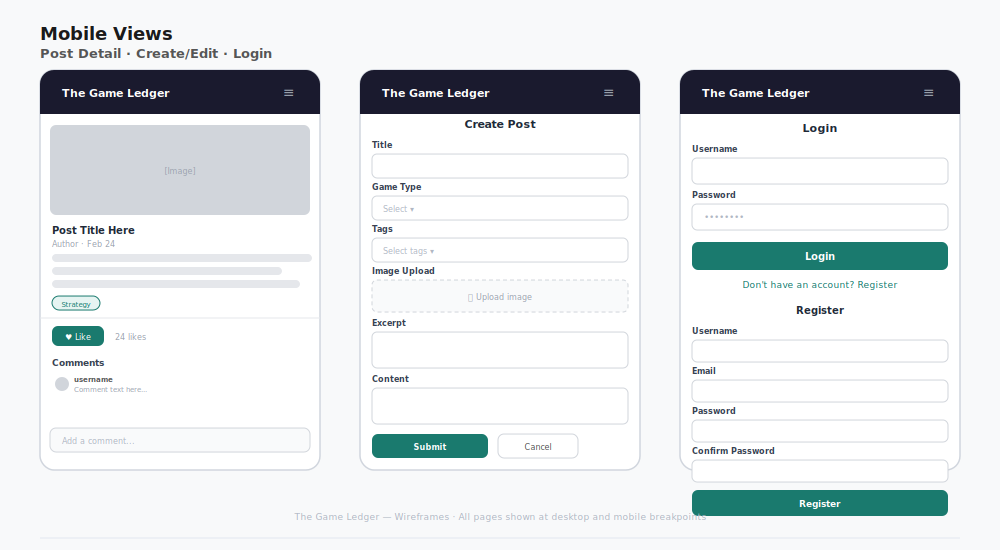
```
-------------------------------+
| Logo        ☰                 |
-------------------------------+
| Post Title                    |
| Author  Date                  |
-------------------------------+
| [Image]                       |
| [Content]                     |
| [Tags]                        |
-------------------------------+
| Like Button  Like/Comment     |
-------------------------------+
| Comments                      |
|  - User  Date  Text  [Delete] |
-------------------------------+
| Add Comment Form              |
-------------------------------+
| Form: Title                   |
| Form: Game Type               |
| Form: Tags                    |
| Form: Image Upload            |
| Form: Excerpt                 |
| Form: Content                 |
| [Submit] [Cancel]             |
-------------------------------+
| Login Form                    |
|  - Username                   |
|  - Password                   |
|  [Login]                      |
|  [Register Link]              |
-------------------------------+
| Register Form                 |
|  - Username                   |
|  - Email                      |
|  - Password                   |
|  - Confirm Password           |
|  [Register]                   |
-------------------------------+
```

---

## Database Structure (ERD)

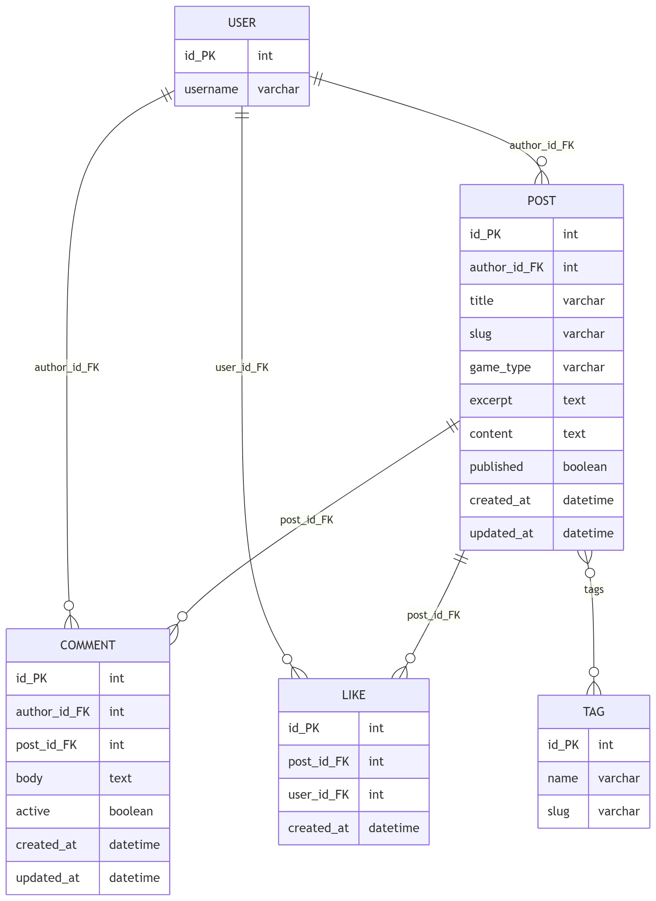

Interactive ERD: [View on dbdocs.io](https://dbdocs.io/jcottle33/Game-Blog-DIagram?view=relationships)

---

## Technologies Used
- Python 3, Django 4.2
- SQLite (local) / PostgreSQL (production)
- HTML, CSS
- Cloudinary (planned for production media)

---

## Testing

### Manual Testing
| Feature         | Test Case                | Expected Result         |
|-----------------|-------------------------|------------------------|
| Post list       | Visit /blog/            | See published posts    |
| Post filter     | Click filter buttons    | Only matching posts    |
| Post search     | Enter search query      | Filtered results       |
| Post create     | Submit new post form    | Post appears in list   |
| Post edit       | Edit own post           | Changes saved          |
| Post delete     | Delete own post         | Post removed           |
| Comment add     | Submit comment form     | Comment appears        |
| Like toggle     | Click like button       | Like/unlike reflected  |
| Auth/register   | Register/login/logout   | Auth state changes     |

### Unit Tests
Run with:
```bash
./.venv/Scripts/python.exe manage.py test blog
```
Covers: Post model, Comment model, Post list view, filtering, relationships.

---

## JavaScript Testing

Client-side JS validation and instant notification logic are tested using Jest.

**To run JS tests:**
1. Install Node.js and npm.
2. Install Jest:
   ```bash
   npm install --save-dev jest
   ```
3. Test file: `static/js/formValidation.test.js` (provided).
4. Add to `package.json`:
   ```json
   "scripts": { "test": "jest" }
   ```
5. Run:
   ```bash
   npx jest static/js/formValidation.test.js
   ```

---

## Deployment
- Heroku (planned)
- **Environment variables required:**
  - `SECRET_KEY`
  - `DATABASE_URL`
  - `CLOUDINARY_URL` (if using Cloudinary)
  - `DEBUG` (set to `False` in production)

---

## Local Setup
1. Create and activate a virtual environment.
2. Install dependencies:
   ```bash
   ./.venv/Scripts/python.exe -m pip install -r requirements.txt
   ```
3. Create `env.py` and set `SECRET_KEY` (and `DATABASE_URL` if using Postgres).
4. Apply migrations:
   ```bash
   ./.venv/Scripts/python.exe manage.py migrate
   ```
5. Run the dev server:
   ```bash
   ./.venv/Scripts/python.exe manage.py runserver
   ```
6. Visit [http://127.0.0.1:8000/](http://127.0.0.1:8000/)

---

## AI Use
- GitHub Copilot and AI tools used for debugging, refactoring, and documentation.
- Reflections on AI use included in README.

---

## Credits
- Project Author: Joshua Cottle
- Icons/Images: Author-provided, user-uploaded content, and the following game cover images used for demonstration:
  - Halo: The Master Chief Collection (© Microsoft/Xbox Game Studios)
  - Hades (© Supergiant Games)
  - Blades in the Dark (© John Harper/One Seven Design)
  - Baldur’s Gate 3 (© Larian Studios)
  - Hollow Knight (© Team Cherry)
  - Wingspan (© Stonemaier Games)
  - D&D Dice/Book illustration (source: unknown)
- All game images are used for educational and demonstration purposes only.

---

## License
This project is licensed under the MIT License. See the LICENSE file for details.

---

## Contact
For questions or feedback, contact [Joshua Cottle](https://github.com/JoshuaCottle).

---

## Validation & Accessibility

CSS Validation

[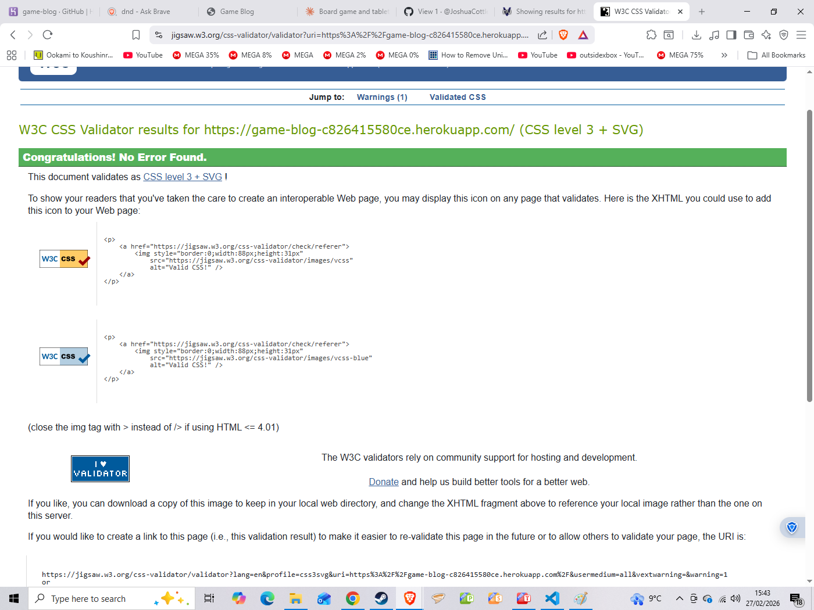](https://jigsaw.w3.org/css-validator/)

### Lighthouse Audit

A Lighthouse accessibility and performance audit was run on the deployed site. See the full report:

[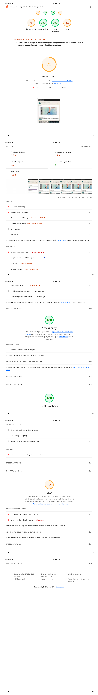](Images/lighthouse_report.png)

Or download the full PDF: [Lighthouse Report PDF](Images/light%20house.pdf)

---

### HTML Validation

The site HTML was validated using the Nu Html Checker. No errors or warnings were found:


---

## Project Board

View and track progress on the official GitHub Project Board:

[Game Blog Project Board](https://github.com/users/JoshuaCottle/projects/7/views/1)
