# The Game Ledger — Game Blog

**Live site:** https://game-blog-c826415580ce.herokuapp.com/  
**Repository:** https://github.com/JoshuaCottle/game_blog

---

## Summary

I built The Game Ledger as a Django blog focused on video, board, and tabletop games. The goal was to create a clean, responsive space where people can share and discover reviews, impressions, and recommendations. Users can register, log in, create and manage posts, comment, and like content. The project includes access control, user feedback messages, and validation evidence (HTML, CSS, accessibility, and performance). Planning and delivery were tracked on a public GitHub Project Board. Assessment-driven improvements are integrated directly into the relevant sections below (especially Features, Deployment, and AI Use) rather than listed as a separate addendum.

---

## Table of Contents
- [Project Overview](#project-overview)
- [Features](#features)
- [User Stories](#user-stories)
- [Agile Delivery](#agile-delivery)
- [Design & Accessibility](#design--accessibility)
- [Wireframes](#wireframes)
- [Database Structure (ERD)](#database-structure-erd)
- [Technologies Used](#technologies-used)
- [Testing](#testing)
- [JavaScript Testing](#javascript-testing)
- [Deployment](#deployment)
- [Local Setup](#local-setup)
- [AI Use](#ai-use)
- [Assessor Evidence Checklist](#assessor-evidence-checklist)
- [Credits](#credits)
- [License](#license)
- [Contact](#contact)

---

## Project Overview

The Game Ledger is my full-stack Django blog project for video, board, and tabletop games. Users can register, create posts with images, comment, and like posts. The home page supports filtering by game type and searching by title.

**Author:** Joshua Cottle  
**Responsibilities:** Project structure, Django models/views/forms, templates, styling, documentation

---

## Features
- Post list with filter buttons (video, board, tabletop, tags) 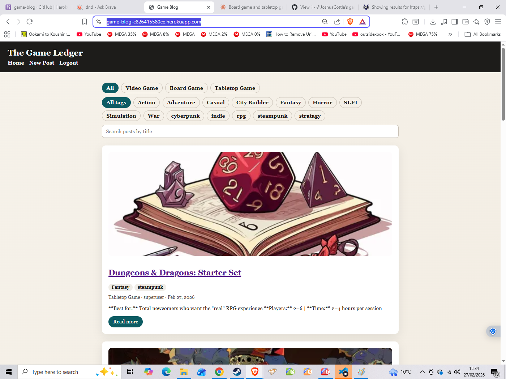
- Search by post title 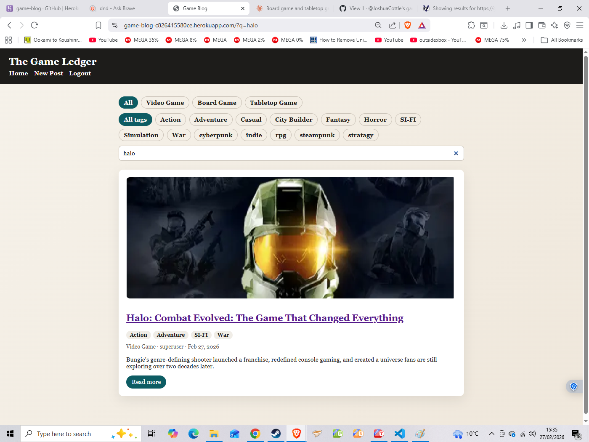
- Image uploads for posts 
- CRUD for posts (author-only edit/delete) 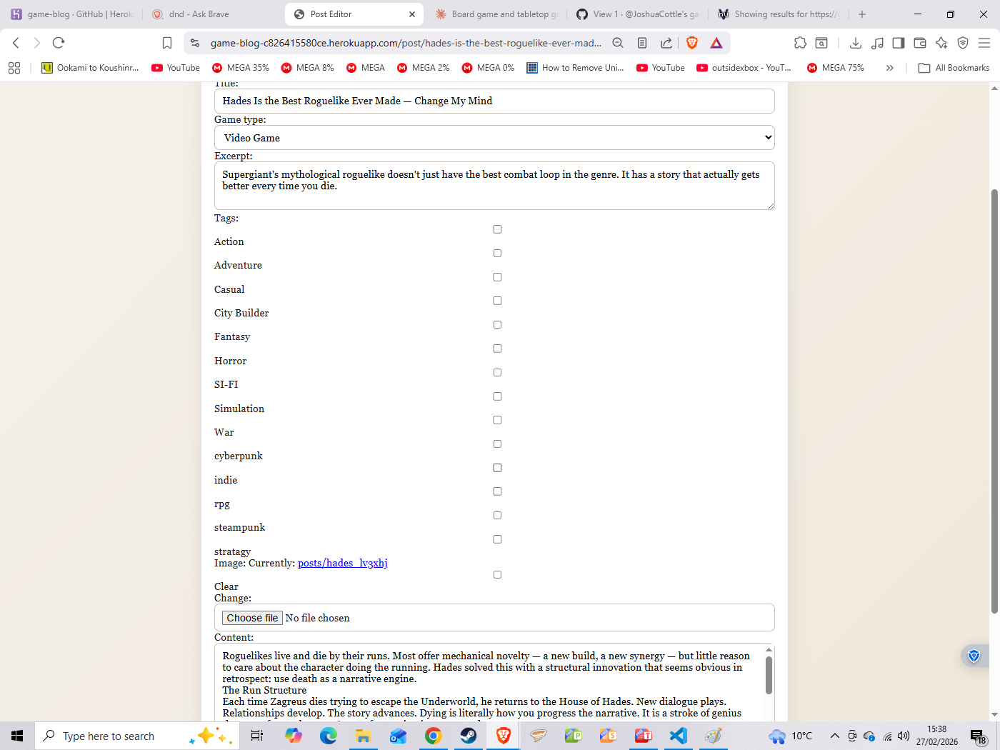
- Comments and likes on post detail pages 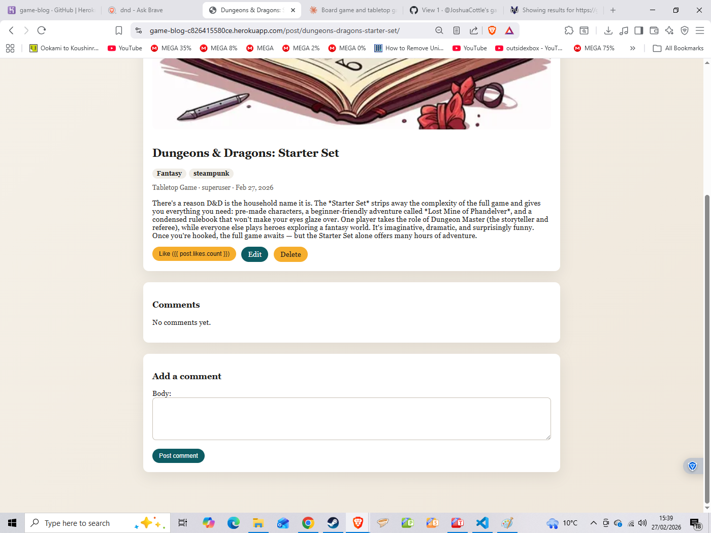
- Authentication (register, login, logout) 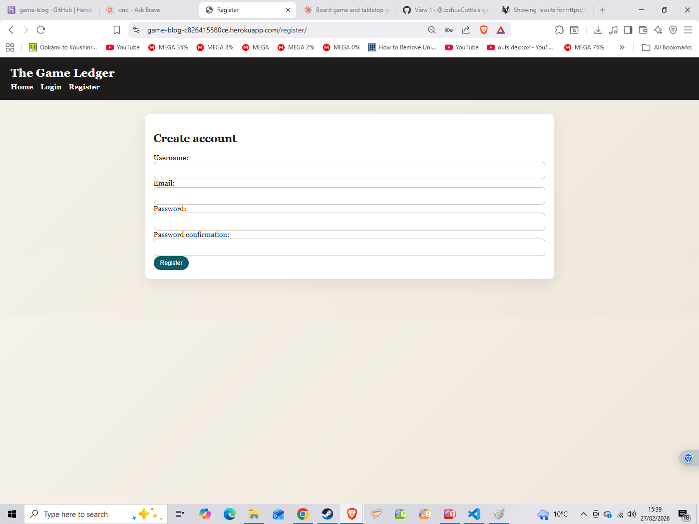
- Responsive, accessible design 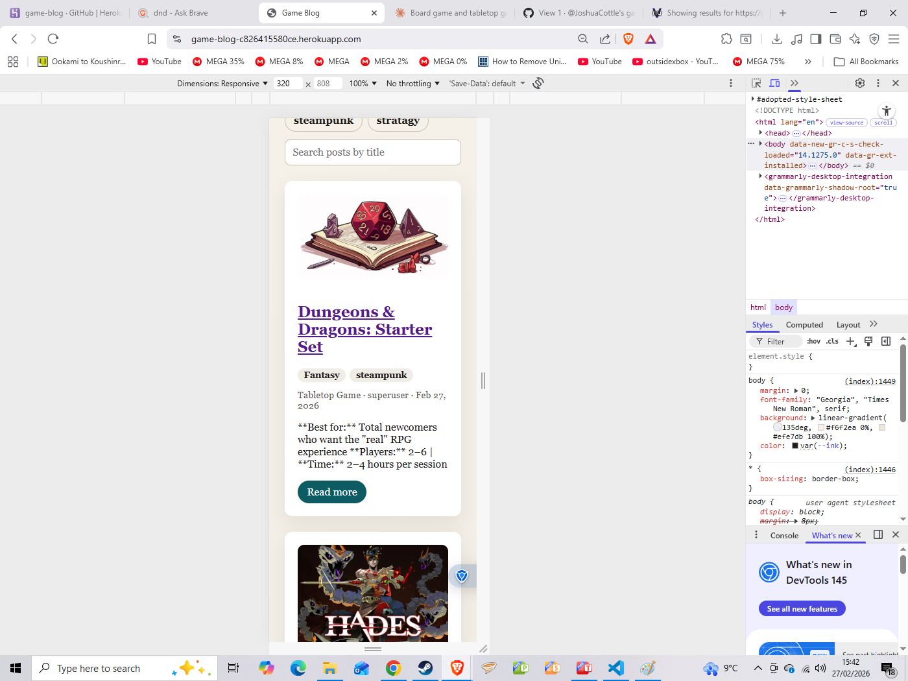
  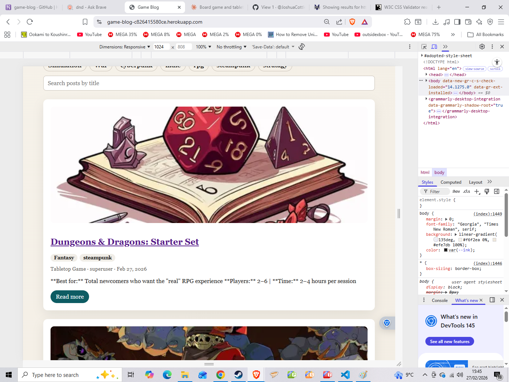
  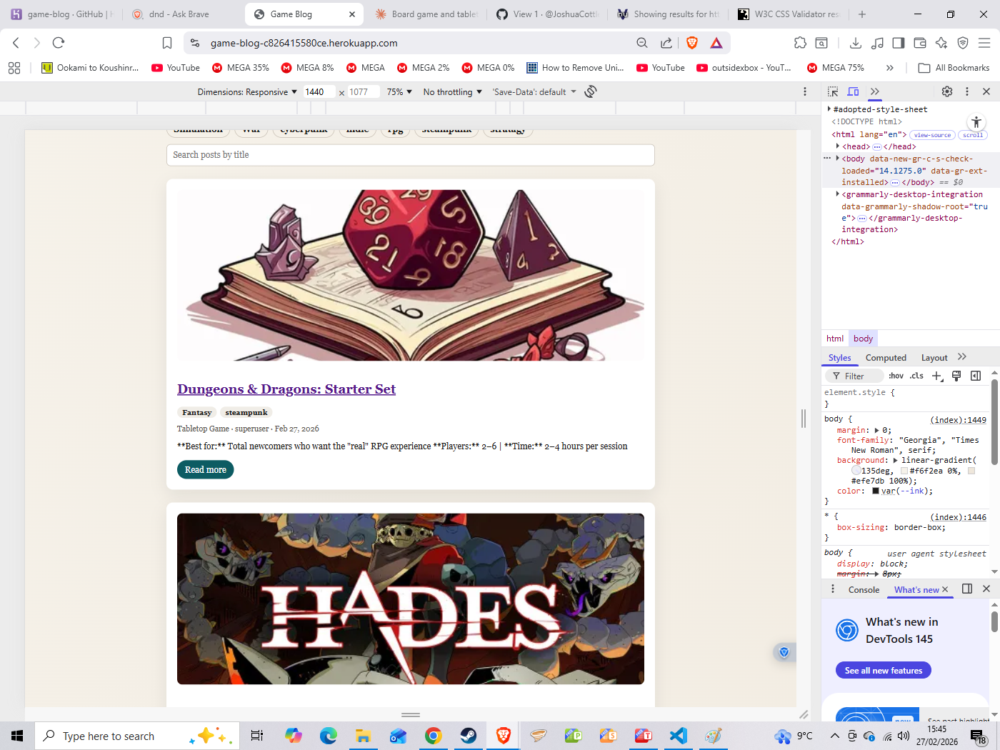
- Welcome section and clear CTAs on the homepage for first-time users
- Like count rendering fixed on post detail pages
- Edit form now pre-selects existing tags when updating a post
---

## User Stories

**Must Have**
- See recent posts with images
- Register, log in, create posts, comment
- Edit own posts, comment and like posts
- Only authors can edit their posts

**Should Have**
- Delete own posts/comments
- Filter posts by game type
- Search posts by title

**Could Have**
- See login state, easy logout
- Admin moderation for posts/comments

---

## Agile Delivery

I used an Agile workflow with iterative releases. For reassessment clarity, I have grouped the work into explicit sprint phases with clear planning, implementation, and review goals.

### Sprint Structure
1. Sprint 1 - Foundation and Authentication
- Project setup, base templates, navigation
- User registration, login, logout
- Permission guards for protected routes

2. Sprint 2 - Core Blog CRUD
- Post model, create/read/update/delete views
- Author-only edit and delete restrictions
- User messages and form validation feedback

3. Sprint 3 - Engagement and Filtering
- Comments and likes
- Tag model and filtering/search functionality
- UX refinements for list/detail interactions

4. Sprint 4 - Quality, Documentation, and Deployment
- Manual and automated testing pass
- Validation evidence (HTML/CSS/Lighthouse)
- Heroku deployment, environment hardening, README completion

### Sprint Artefacts
- Backlog and progress tracked on GitHub Project Board
- User stories moved across To Do, In Progress, and Done
- Commits linked to sprint scope and acceptance criteria

For reassessment, each sprint can also be shown as a dedicated GitHub project view or milestone so the delivery phases are easier to follow.

---

## Design & Accessibility
- Clean, card-based layout
- Accessible form controls, clear spacing
- Responsive for desktop and mobile
- Semantic HTML, ARIA labels, skip-to-content link
- Lighthouse audit for WCAG compliance

---

## Wireframes

### Home / Post List (Desktop)
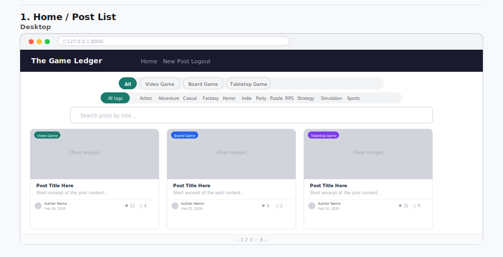
```
------------------------------------------------------
| Logo         Home  Login/Register  Profile           |
------------------------------------------------------
| Filter: Video  Board  Tabletop  Tags                 |
------------------------------------------------------
| Search Bar                                       [ ] |
------------------------------------------------------
| [Post Card]   [Post Card]   [Post Card]   ...        |
|  - Image      - Title        - Excerpt               |
|  - Author     - Date         - Like/Comment Count    |
------------------------------------------------------
| Pagination                                          |
------------------------------------------------------
```

### Home / Post List (Mobile)
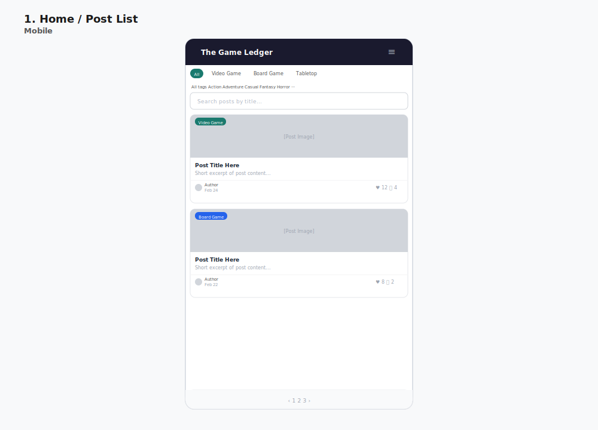
```
-------------------------------+
| Logo        ☰                 |
-------------------------------+
| Filter: Video  Board  Tabletop|
| Tags                          |
-------------------------------+
| Search Bar                    |
-------------------------------+
| [Post Card]                   |
|  - Image                      |
|  - Title                      |
|  - Excerpt                    |
|  - Author  Date  Like/Comment |
-------------------------------+
| Pagination                    |
-------------------------------+
```

### Post Detail (Desktop)
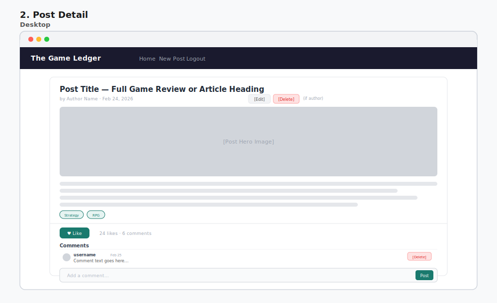
```
------------------------------------------------------
| Logo         Home  Login/Register  Profile           |
------------------------------------------------------
| Post Title                                         |
| by Author on Date   [Edit] [Delete] (if author)     |
------------------------------------------------------
| [Image]                                            |
| [Content]                                          |
| [Tags]                                             |
------------------------------------------------------
| Like Button  Like Count  Comment Count              |
------------------------------------------------------
| Comments:                                          |
|  - User  Date  Comment Text  [Delete] (if owner)    |
|  ...                                               |
------------------------------------------------------
| Add Comment Form                                   |
------------------------------------------------------
```

### Post Create/Edit (Desktop)
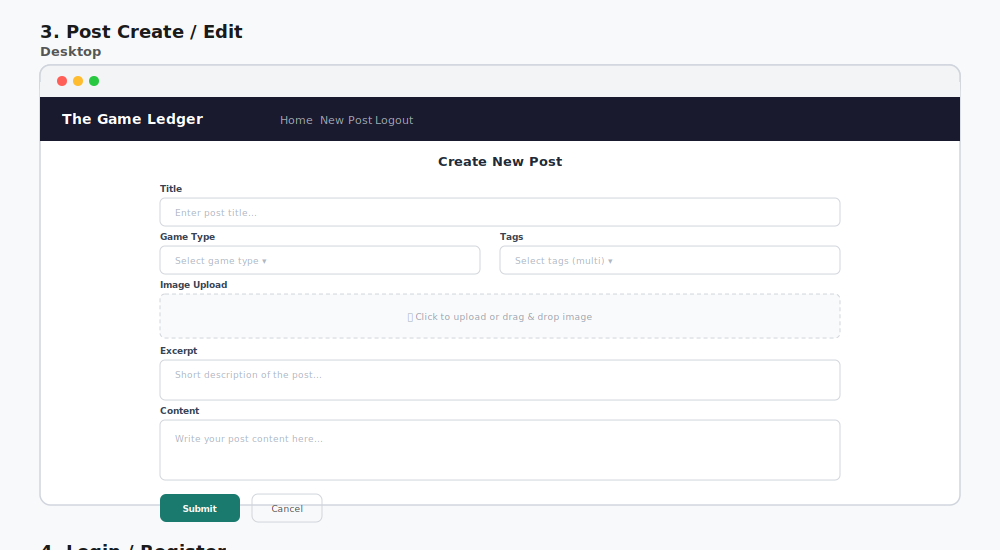
```
------------------------------------------------------
| Logo         Home  Logout  Profile                   |
------------------------------------------------------+
| Form: Title                                         |
| Form: Game Type Dropdown                            |
| Form: Tags Multi-select                             |
| Form: Image Upload                                  |
| Form: Excerpt                                       |
| Form: Content                                       |
| [Submit] [Cancel]                                   |
------------------------------------------------------+
```

### Login/Register (Desktop)
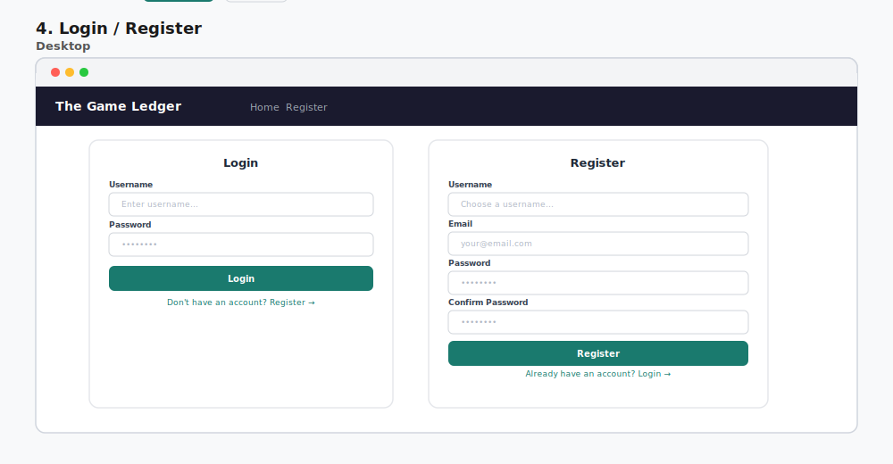
```
------------------------------------------------------+
| Logo         Home  Register                          |
------------------------------------------------------+
| Login Form:                                         |
|  - Username                                         |
|  - Password                                         |
|  [Login]                                            |
|  [Register Link]                                    |
------------------------------------------------------+
| Register Form:                                      |
|  - Username                                         |
|  - Email                                            |
|  - Password                                         |
|  - Confirm Password                                 |
|  [Register]                                         |
------------------------------------------------------+
```

### Mobile Views (All Pages)
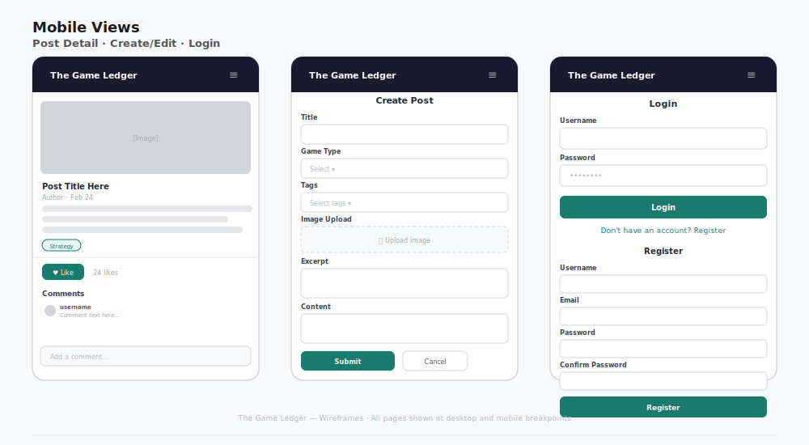
```
-------------------------------+
| Logo        ☰                 |
-------------------------------+
| Post Title                    |
| Author  Date                  |
-------------------------------+
| [Image]                       |
| [Content]                     |
| [Tags]                        |
-------------------------------+
| Like Button  Like/Comment     |
-------------------------------+
| Comments                      |
|  - User  Date  Text  [Delete] |
-------------------------------+
| Add Comment Form              |
-------------------------------+
| Form: Title                   |
| Form: Game Type               |
| Form: Tags                    |
| Form: Image Upload            |
| Form: Excerpt                 |
| Form: Content                 |
| [Submit] [Cancel]             |
-------------------------------+
| Login Form                    |
|  - Username                   |
|  - Password                   |
|  [Login]                      |
|  [Register Link]              |
-------------------------------+
| Register Form                 |
|  - Username                   |
|  - Email                      |
|  - Password                   |
|  - Confirm Password           |
|  [Register]                   |
-------------------------------+
```

---

## Database Structure (ERD)

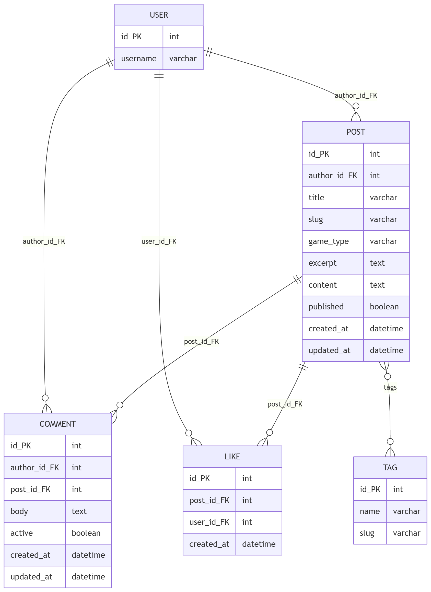

Interactive ERD: [View on dbdocs.io](https://dbdocs.io/jcottle33/Game-Blog-DIagram?view=relationships)

---

## Technologies Used
- Python 3, Django 4.2
- SQLite (local) / PostgreSQL (production)
- HTML, CSS
- Cloudinary (media storage)

---

## Testing

### Manual Testing
| Feature         | Test Case                | Expected Result         |
|-----------------|-------------------------|------------------------|
| Post list       | Visit /blog/            | See published posts    |
| Post filter     | Click filter buttons    | Only matching posts    |
| Post search     | Enter search query      | Filtered results       |
| Post create     | Submit new post form    | Post appears in list   |
| Post edit       | Edit own post           | Changes saved          |
| Post delete     | Delete own post         | Post removed           |
| Comment add     | Submit comment form     | Comment appears        |
| Like toggle     | Click like button       | Like/unlike reflected  |
| Auth/register   | Register/login/logout   | Auth state changes     |

### Unit Tests
Run with:
```bash
./.venv/Scripts/python.exe manage.py test blog
```
Covers: Post model, Comment model, Post list view, filtering, relationships.

---

## JavaScript Testing

Client-side JS validation and instant notification logic are tested using Jest.

**To run JS tests:**
1. Install Node.js and npm.
2. Install Jest:
   ```bash
   npm install --save-dev jest
   ```
3. Test file: `static/js/formValidation.test.js` (provided).
4. Add to `package.json`:
   ```json
   "scripts": { "test": "jest" }
   ```
5. Run:
   ```bash
   npx jest static/js/formValidation.test.js
   ```

---

## Deployment

The application is deployed to Heroku and uses PostgreSQL in production.

This section documents a full clone -> run -> deploy workflow for this specific repository so a reviewer can reproduce deployment without external setup guides.

### 1. Deployment Stack
- Platform: Heroku
- Runtime: Python (from `.python-version`)
- WSGI server: Gunicorn (`Procfile`: `web: gunicorn Game_Blog.wsgi`)
- Database (production): Heroku Postgres via `DATABASE_URL`
- Media storage: Cloudinary (`django-cloudinary-storage`)
- Static files output path: `staticfiles/` via `STATIC_ROOT`

### 2. Required Files and Why They Matter
- `requirements.txt`
  Contains all Python dependencies Heroku installs during build.
- `Procfile`
  Tells Heroku how to run the app process.
- `.python-version`
  Pins the Python version used by Heroku build/runtime.
- `.gitignore`
  Excludes sensitive/local files such as `env.py`, `.venv/`, and `db.sqlite3`.
- `Game_Blog/settings.py`
  Reads environment variables and switches DB config based on `DATABASE_URL`.

### 3. One-Time Prerequisites (Local Machine)
Install and verify:

1. Git
2. Python 3.11+ (or the version in `.python-version`)
3. Heroku CLI

Verify installs:

```bash
git --version
python --version
heroku --version
```

### 4. Clone and Run Locally
1. Clone the repository:
   ```bash
   git clone https://github.com/JoshuaCottle/game_blog.git
   cd game_blog
   ```
2. Create and activate virtual environment (Windows Git Bash):
   ```bash
   python -m venv .venv
   source .venv/Scripts/activate
   ```
3. Install dependencies:
   ```bash
   pip install -r requirements.txt
   ```
4. Create a local `env.py` in project root (this file is git-ignored):
   ```python
   import os

   os.environ.setdefault('SECRET_KEY', 'replace-with-a-dev-secret-key')
   os.environ.setdefault('DEVELOPMENT', 'True')

   # Local SQLite (default in settings.py, set explicitly for clarity)
   os.environ.setdefault('DATABASE_URL', 'sqlite:///db.sqlite3')

   # Required if uploads/media are stored through Cloudinary
   os.environ.setdefault('CLOUDINARY_URL', 'cloudinary://<api_key>:<api_secret>@<cloud_name>')
   ```
5. Run database migrations:
   ```bash
   python manage.py migrate
   ```
6. (Optional) Create admin user:
   ```bash
   python manage.py createsuperuser
   ```
7. Start development server:
   ```bash
   python manage.py runserver
   ```
8. Open `http://127.0.0.1:8000/`.

### 5. Create Heroku App and Resources
You can deploy using either dashboard or CLI. CLI method shown below.

1. Log in:
   ```bash
   heroku login
   ```
2. Create app (replace name with your own unique value):
   ```bash
   heroku create <your-app-name>
   ```
3. Add Postgres:
   ```bash
   heroku addons:create heroku-postgresql:mini -a <your-app-name>
   ```
4. Ensure buildpack is Python (usually auto-detected):
   ```bash
   heroku buildpacks:set heroku/python -a <your-app-name>
   ```

### 6. Configure Heroku Environment Variables
Set config vars in Heroku Dashboard -> Settings -> Config Vars, or via CLI.

Required:
- `SECRET_KEY`
- `DATABASE_URL` (auto-set after adding Heroku Postgres)
- `CLOUDINARY_URL` (if using Cloudinary-backed media uploads)

Project note:
- `DEBUG` is hardcoded `False` in current `Game_Blog/settings.py`, so no Heroku `DEBUG` variable is required for production safety.
- `ALLOWED_HOSTS` already includes this deployed app domain: `game-blog-c826415580ce.herokuapp.com`.

Example CLI commands:

```bash
heroku config:set SECRET_KEY="<strong-random-secret>" -a <your-app-name>
heroku config:set CLOUDINARY_URL="cloudinary://<api_key>:<api_secret>@<cloud_name>" -a <your-app-name>
```

Check all current vars:

```bash
heroku config -a <your-app-name>
```

### 7. Deploy to Heroku
If Heroku app is already linked to this git repo:

```bash
git push heroku main
```

If your branch is `master`, use:

```bash
git push heroku master
```

Then run release tasks:

```bash
heroku run python manage.py migrate -a <your-app-name>
heroku run python manage.py createsuperuser -a <your-app-name>
heroku open -a <your-app-name>
```

### 8. Verify Deployment (Functional + Security)
After deployment, verify:
- App loads successfully (no Heroku application error page)
- Registration/login/logout work
- Post create/edit/delete works for authenticated users
- Comments and likes function correctly
- Media uploads resolve from Cloudinary URLs
- Admin panel accessible only with admin credentials
- No secrets are committed to repository
- Production uses Postgres (`DATABASE_URL`) instead of SQLite

### 9. Updating an Existing Deployment
For later changes:

```bash
git add .
git commit -m "Describe change"
git push origin main
git push heroku main
heroku run python manage.py migrate -a <your-app-name>
```

### 10. Common Deployment Issues
- Build fails on Heroku:
  Confirm `requirements.txt` and `Procfile` exist in repo root.
- `ModuleNotFoundError` at boot:
  Missing dependency in `requirements.txt`; add it, commit, redeploy.
- `DisallowedHost`:
  Add deployed domain to `ALLOWED_HOSTS` in `Game_Blog/settings.py`.
- DB errors after deploy:
  Confirm Postgres add-on exists and run migrations.
- Media upload/display errors:
  Confirm `CLOUDINARY_URL` is correctly set.
- Static assets missing:
  Confirm `STATIC_ROOT` is configured and collectstatic runs during build.

---

## Local Setup
Use this as a quick-start version of the full process above.

1. Clone and enter project directory:
   ```bash
   git clone https://github.com/JoshuaCottle/game_blog.git
   cd game_blog
   ```
2. Create and activate virtual environment:
   ```bash
   python -m venv .venv
   source .venv/Scripts/activate
   ```
3. Install dependencies:
   ```bash
   pip install -r requirements.txt
   ```
4. Create `env.py` and set local variables (`SECRET_KEY`, optional `DATABASE_URL`, and `CLOUDINARY_URL` if needed).
5. Apply migrations:
   ```bash
   python manage.py migrate
   ```
6. Run server:
   ```bash
   python manage.py runserver
   ```
7. Open `http://127.0.0.1:8000/`.

---

## AI Use

I used AI tools throughout this project, but not as an autopilot. I treated AI suggestions as first drafts, then checked everything against my own project logic and testing. In practice, AI helped me move faster on boilerplate and gave me useful second opinions when I was stuck, but final decisions and validation were always manual.

### 1. AI-Assisted Code Creation (LO8.1)
Where AI helped most here was speed. I used it to draft initial versions of repetitive code, then tailored the output to fit this project.

- Drafting first-pass structures for class-based CRUD views and template sections
- Exploring cleaner naming and small refactors when readability felt off
- Generating alternative approaches for form feedback and validation flow

Examples from this project:
- I used AI suggestions while structuring the CRUD flow, then adapted the code so permissions and behavior matched my app.
- I used AI during the tags feature work as a brainstorming tool, but the final Many-to-Many design and query behavior were manually implemented and tested.

### 2. AI-Assisted Debugging (LO8.2)
I used AI most effectively when debugging because it helped me quickly generate hypotheses and narrow down likely causes.

- I used it to reason through why template output looked wrong in specific UI states.
- I used it to compare expected behavior vs actual behavior in edit forms and post interactions.
- I used it to sanity-check fix options before applying them.

Concrete fixes where AI assisted:
- Like count rendering in the post detail template.
- Tag prefill behavior in the post edit form.

Validation steps I ran after each fix:
- Manual browser checks across the affected user flow
- Django checks and regression checks on related pages

### 3. AI-Assisted Performance and UX Improvements (LO8.3)
AI was useful for generating UX improvement ideas quickly, especially around first-time user clarity.

- I used AI prompts to compare different homepage onboarding patterns.
- I used those suggestions to shape clearer CTA choices and page copy.
- I used AI suggestions as a review pass for consistency in user-facing messages.

What actually changed in this project:
- A clearer welcome/CTA section on the homepage
- Better consistency in wording around create/update/delete actions

### 4. Reflection on Workflow Impact (LO8.4)
Using AI improved my workflow most during two moments: starting a new block of code and getting unstuck in debugging. The time savings were real, especially on boilerplate and first-pass problem analysis.

The main limitation was context drift. Sometimes suggestions looked correct but did not match my existing project setup or coding style, so blind copy/paste would have caused issues.

What I learned:
- Better prompts produced better results
- Smaller, focused prompts were easier to validate
- Manual testing after AI-assisted changes is non-negotiable

### AI Verification Process
- I manually reviewed every AI-assisted change before keeping it.
- I tested affected user flows in the browser after each meaningful update.
- I ran Django checks and project tests where relevant before finalizing.

### 5. AI Prompt Log (Examples + Commit Evidence)
The examples below are representative prompt snippets from my development workflow and are linked to corresponding repository commits.

| Goal | Prompt Snippet Used | AI Output Used | My Validation | Commit Evidence |
|---|---|---|---|---|
| Fix like count rendering in post detail | "In Django template post detail, fix like count rendering so it prints an integer count beside Like/Unlike." | Suggested using `{{ post.likes.count }}` directly in the button label. | Confirmed the post detail page renders the count correctly before and after toggling likes while authenticated. | [379c248](https://github.com/JoshuaCottle/game_blog/commit/379c248) |
| Pre-fill tags on post edit | "In UpdateView and template checkboxes, preselect existing ManyToMany tags when editing a post." | Suggested passing selected tag IDs from view context and checking IDs in the template loop. | Verified existing tags appear checked on the edit screen and persist correctly after save. | [379c248](https://github.com/JoshuaCottle/game_blog/commit/379c248) |
| Improve first-time user onboarding | "Suggest a simple welcome section with clear CTAs for a Django blog list page." | Suggested adding welcome copy with browse/create account actions based on auth state. | Confirmed visibility and behavior for authenticated and unauthenticated users. | [379c248](https://github.com/JoshuaCottle/game_blog/commit/379c248) |
| Improve deployment reproducibility documentation | "Create a practical Heroku deployment checklist including required files, config vars, and migration steps." | Produced a structured draft that I adapted to this repository's exact settings and stack. | Cross-checked against `Game_Blog/settings.py`, `Procfile`, and installed packages before publishing. | [379c248](https://github.com/JoshuaCottle/game_blog/commit/379c248), [db3b453](https://github.com/JoshuaCottle/game_blog/commit/db3b453) |

---

## Assessor Evidence Checklist

Use this checklist to quickly verify the assessed requirements:

- [x] Deployment section is reproducible end-to-end without external docs.
- [x] Required environment variables are listed and explained.
- [x] Local clone and run instructions are complete and tested.
- [x] AI section documents code creation decisions (LO8.1).
- [x] AI section documents bug-fixing process and examples (LO8.2).
- [x] AI section documents UX/performance optimization support (LO8.3).
- [x] AI section includes workflow reflection and validation steps (LO8.4).
- [x] AI section includes prompt examples mapped to commit evidence.
- [x] Post edit form pre-fills existing tags correctly.
- [x] Post detail page correctly renders like count.
- [x] Homepage includes clear CTA for new users.

---

## Credits
- Project Author: Joshua Cottle
- App screenshots, wireframes, and validation screenshots in this README were created by me during development unless noted otherwise.

### Image Attribution (Used in README)

| File | Source | Notes |
|---|---|---|
| `Images/image.png`, `Images/image-1.png`, `Images/picture add.png`, `Images/crud.png`, `Images/comments-likes.png`, `Images/register.png`, `Images/mobile.png`, `Images/laptop.png`, `Images/PC.png` | Author-created project screenshots | Captured from my own app during development/testing. |
| `Images/01-home-desktop.svg`, `Images/02-home-mobile.svg`, `Images/03-post-detail-desktop.svg`, `Images/04-create-edit-desktop.svg`, `Images/05-login-register-desktop.svg`, `Images/06-mobile-views.svg` | Author-created wireframes | Created for project planning and documentation. |
| `Images/mermaid-diagram-2026-02-26-225209.png` | Author-created ERD export | Generated from my ERD workflow for this project. |
| `Images/css-validation.png` | W3C CSS Validator: https://jigsaw.w3.org/css-validator/ | Screenshot of my own validation run. |
| `Images/lighthouse_report.png`, `Images/light house.pdf` | Google Lighthouse report (local run) | Output from my own audit run on the deployed project. |
| `Images/HTML.png` | W3C Nu HTML Checker: https://validator.w3.org/nu/ | Screenshot of my own validation run. |

### Third-Party Game/Theme Images Used in Project Content

| File | Source URL | Rights / Attribution Note |
|---|---|---|
| `Images/halo.png` | https://store.steampowered.com/app/976730/Halo_The_Master_Chief_Collection/ | Halo IP © Microsoft/Xbox Game Studios. Used for educational demo content only. |
| `Images/hades.webp` | https://store.steampowered.com/app/1145360/Hades/ | Hades IP © Supergiant Games. Used for educational demo content only. |
| `Images/blades-in-the-dark-cover.webp` | https://bladesinthedark.com/ | Blades in the Dark © John Harper / One Seven Design. Used for educational demo content only. |
| `Images/baldus gate.webp` | https://baldursgate3.game/ | Baldur's Gate 3 © Larian Studios / Wizards of the Coast. Used for educational demo content only. |
| `Images/Wingspan.webp` | https://stonemaiergames.com/games/wingspan/ | Wingspan © Stonemaier Games. Used for educational demo content only. |
| `Images/d20-dice-dnd-rpg-board-game-gaming-concept_1324823-7987.webp` | Unverified exact origin (filename suggests stock image distribution) | D&D-themed decorative image. If exact original creator/source is confirmed later, this entry will be updated. |

- Where an exact original upload page could not be confirmed from this environment, I have clearly marked it as unverified.
- All third-party game/brand images are included for non-commercial educational demonstration only.

---

## License
This project is licensed under the MIT License. See the LICENSE file for details.

---

## Contact
For questions or feedback, contact [Joshua Cottle](https://github.com/JoshuaCottle).

---

## Validation & Accessibility

CSS Validation

[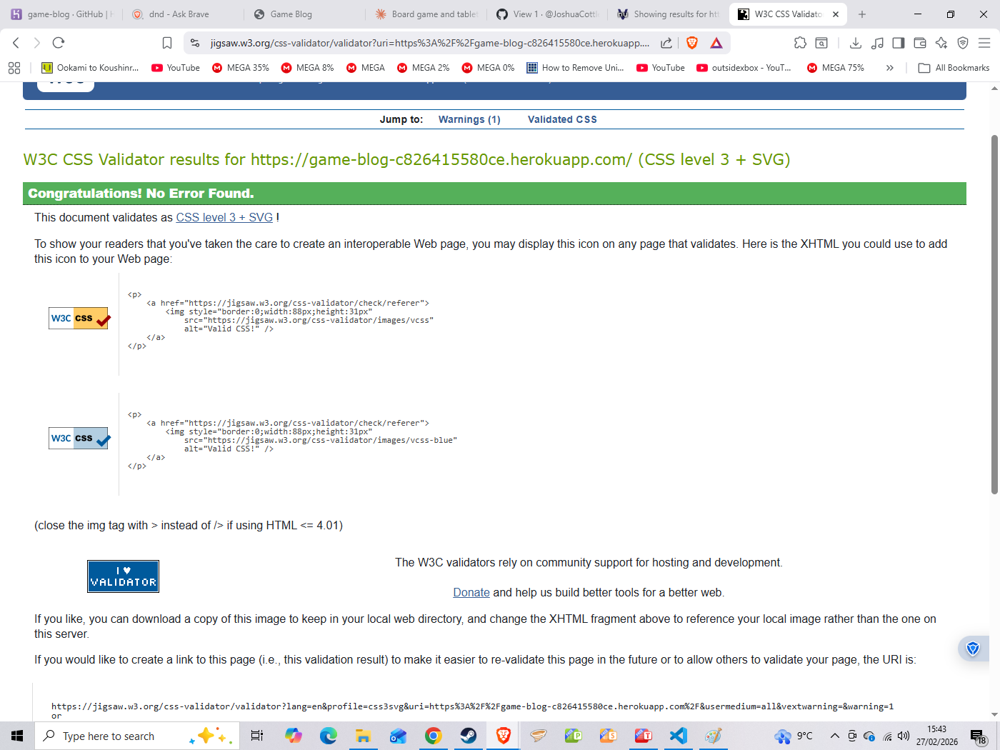](https://jigsaw.w3.org/css-validator/)

### Lighthouse Audit

A Lighthouse accessibility and performance audit was run on the deployed site. See the full report:

[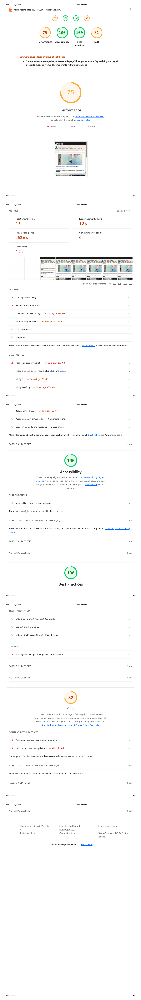](Images/lighthouse_report.png)

Or download the full PDF: [Lighthouse Report PDF](Images/light%20house.pdf)

---

### HTML Validation

The site HTML was validated using the Nu Html Checker. No errors or warnings were found:

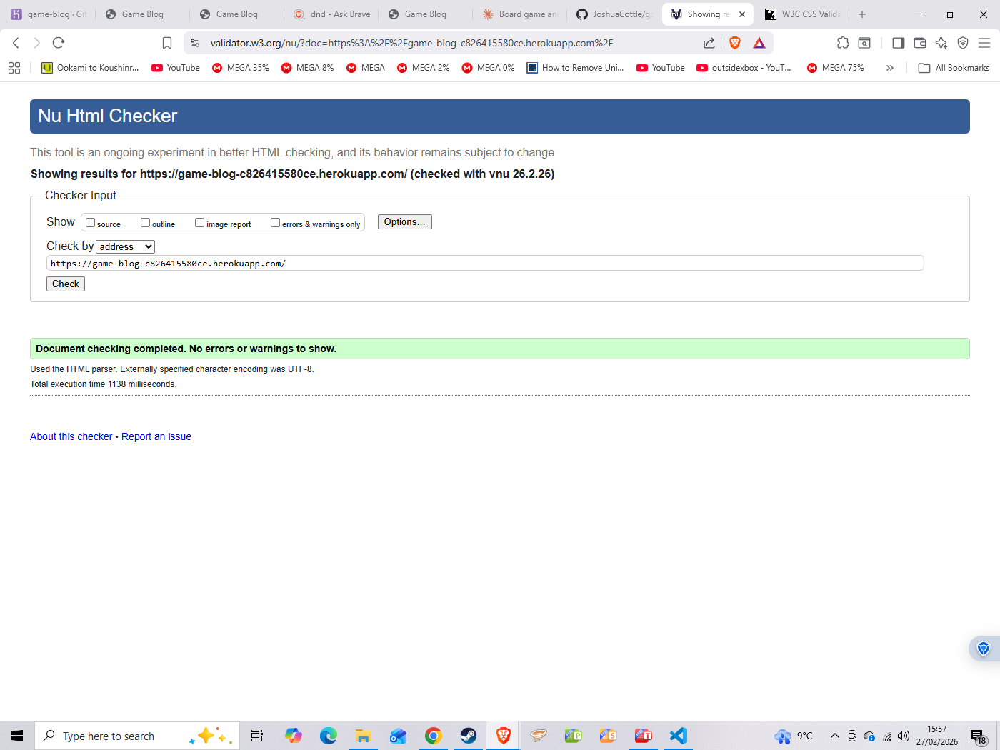

---

## Project Board

View and track progress on the official GitHub Project Board:

[Game Blog Project Board](https://github.com/users/JoshuaCottle/projects/7/views/1)
